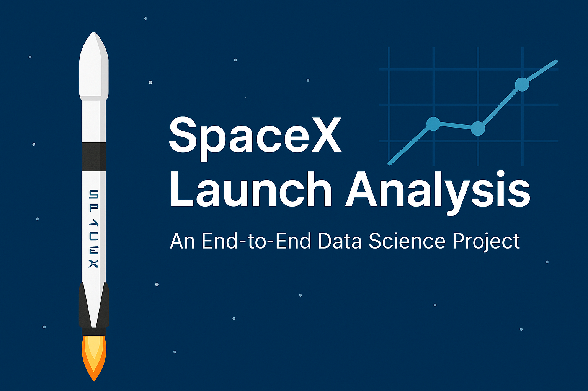
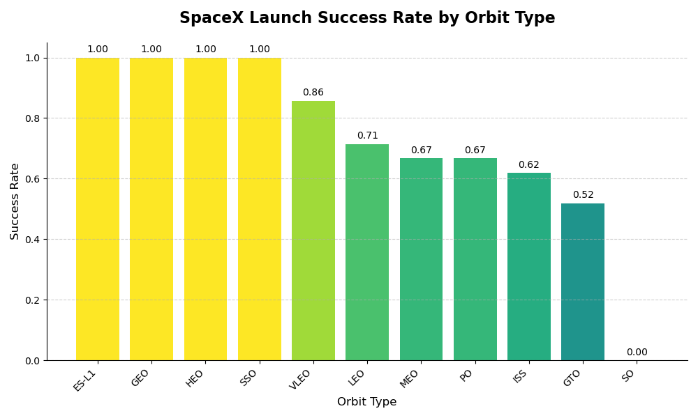
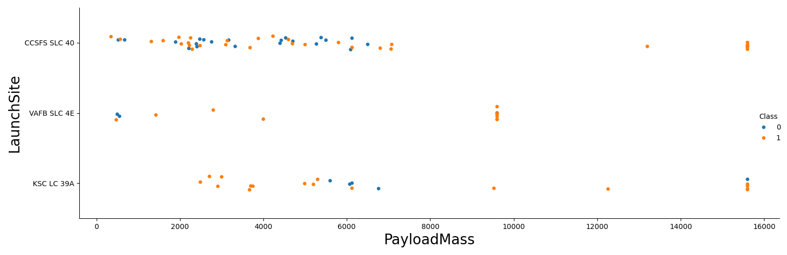
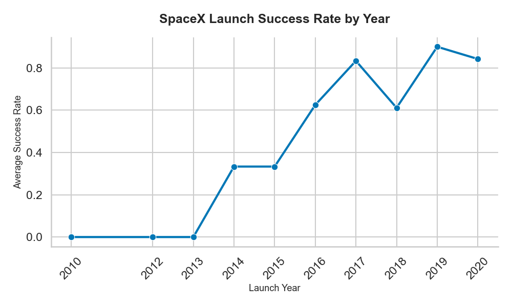
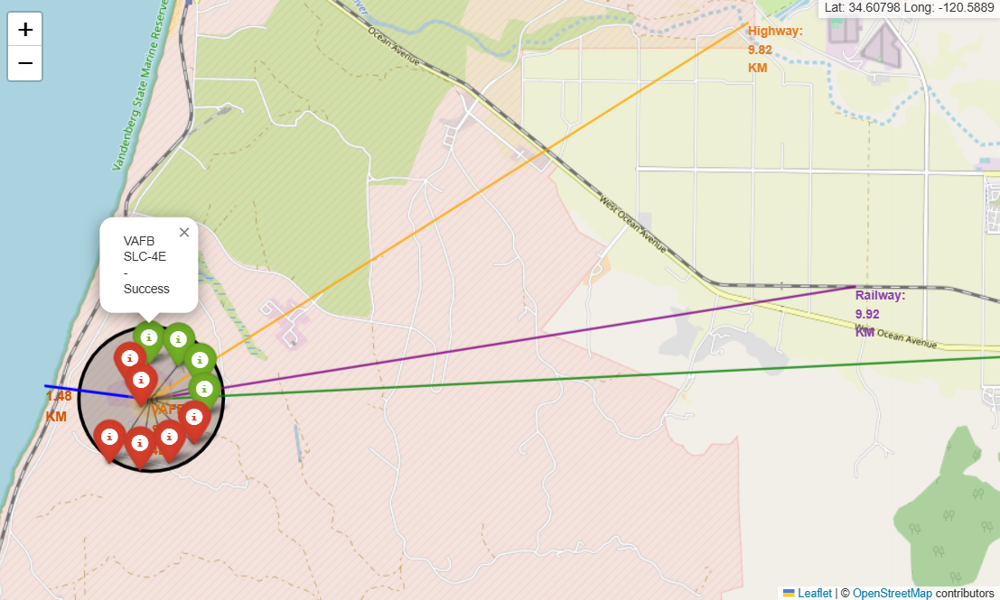
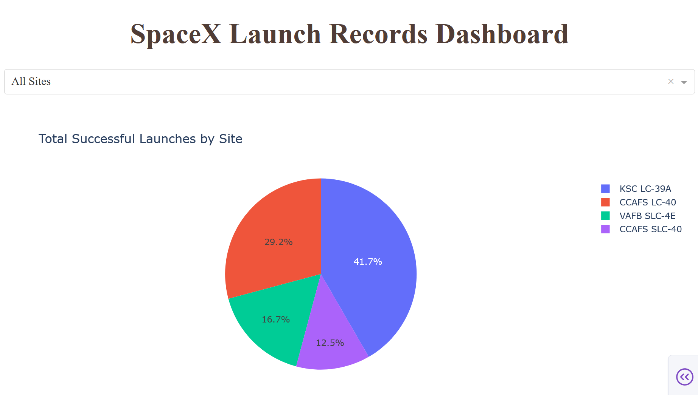
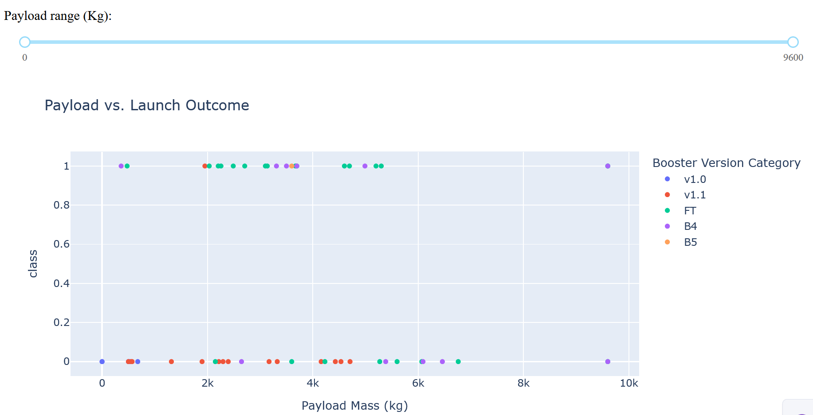
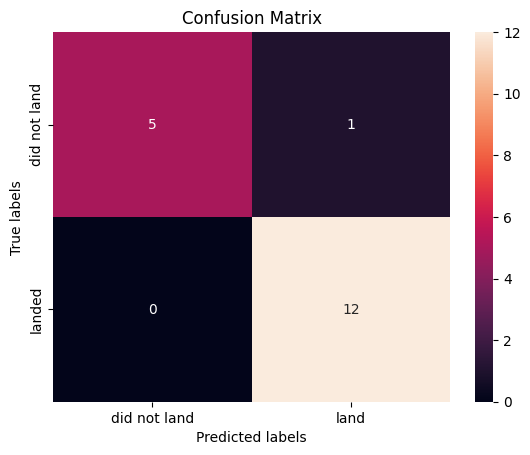

## SpaceX Launch Analysis

### *An End-to-End Data Science Project — from API to Prediction*



---

### Overview

This project presents a **complete data science workflow** analyzing real SpaceX Falcon 9 launch data.
It covers everything from **data collection and wrangling** to **exploratory data analysis**, **interactive visualization**, and **predictive modeling**.

> **Goal:** Identify key factors influencing rocket landing success and build predictive models to estimate launch outcomes.

---

### Project Structure

```bash
📂 spacex-launch-analysis/
│
├── datacollection_part1.py          # Collect launch data via SpaceX API
├── datacollection_part2.py          # Web-scrape launch data from Wikipedia
├── eda_datawrangling.py             # Clean and preprocess datasets
├── eda_visualization.py             # Exploratory data analysis with visuals
├── eda_sql.ipynb                    # SQL-based data exploration
├── interactive.py                   # Interactive Folium map (geospatial analysis)
├── predictive_analytics.py          # Machine learning model training and evaluation
├── spacex-dash-app.py               # Plotly Dash interactive dashboard
│
├── dataset_part_1.csv               # Raw merged dataset
├── dataset_part_2.csv               # Cleaned dataset with Class label
├── dataset_part_3.csv               # Encoded dataset for ML models
│
└── README.md
```

---

### Project Pipeline

| Phase                                  | Description                                                                                             |
| -------------------------------------- | ------------------------------------------------------------------------------------------------------- |
| **1. Data Collection**                 | Fetched launch data using the **SpaceX REST API (v4)** and **Wikipedia scraping** (BeautifulSoup).      |
| **2. Data Wrangling**                  | Cleaned, merged, and filtered datasets. Created the `Class` label (1 = success, 0 = failure).           |
| **3. Exploratory Data Analysis (EDA)** | Visualized success patterns across payload mass, orbit type, and launch site.                           |
| **4. Interactive Visualization**       | Built **Folium** maps for spatial exploration and a **Plotly Dash** dashboard for user-driven analysis. |
| **5. Predictive Analytics**            | Trained and evaluated ML models (Logistic Regression, SVM, Decision Tree, KNN) using **GridSearchCV**.  |

---

### Exploratory Data Analysis (EDA)

#### Launch Success Rate by Orbit Type



#### Payload vs Launch Success



#### Launch Success by Year



---

### Interactive Geospatial Map

Explore launch sites, success outcomes, and proximity to coastlines, cities, and railways.



Features:

* Green markers → successful landings
* Red markers → failed attempts
* Dynamic lines showing nearest coastline and infrastructure proximity

Run locally:

```bash
python interactive.py
```

---

### Plotly Dash Interactive Dashboard




**Features:**

* Dropdown to filter by **Launch Site**
* Slider to explore **Payload Ranges**
* Dynamic **Pie Chart** and **Scatter Plot**
* Responsive interactivity with Plotly callbacks

Run the app:

```bash
python spacex-dash-app.py
```

Then visit: [http://127.0.0.1:8050](http://127.0.0.1:8050)

---

### Predictive Modeling

| Model                    | Accuracy (%) | Confusion Matrix    |
| ------------------------ | ------------ | ------------------- |
| Logistic Regression      | 83.3         | `[[3, 3], [0, 12]]` |
| Support Vector Machine   | 88.9         | `[[0, 6], [0, 12]]` |
| Decision Tree Classifier | **90.0**     | `[[4, 2], [0, 12]]` |
| K-Nearest Neighbors      | 86.1         | `[[0, 6], [0, 12]]` |

#### Confusion Matrices

| Model                  | Visualization                                                                    |
| ---------------------- | -------------------------------------------------------------------------------- |
| Logistic Regression    |   |
| Support Vector Machine |                      |
| Decision Tree          |  |
| K-Nearest Neighbors    |                      |

---

### Tools & Technologies

| Category             | Tools                                         |
| -------------------- | --------------------------------------------- |
| **Data Collection**  | Python, Requests, BeautifulSoup, SpaceX API   |
| **Data Cleaning**    | Pandas, NumPy                                 |
| **Visualization**    | Matplotlib, Seaborn, Plotly, Folium           |
| **Machine Learning** | Scikit-learn (LogReg, SVM, DecisionTree, KNN) |
| **Dashboarding**     | Plotly Dash                                   |
| **Environment**      | Jupyter Notebook, Python 3.10+                |

---

### Key Insights

* Payload mass has a **non-linear relationship** with landing success.
* Launch Site **KSC LC-39A** has the highest mission success rate.
* **Decision Tree** classifier achieved **90% accuracy** with zero false negatives.
* SpaceX’s mission reliability shows a **steady improvement** across years.

---

### Future Enhancements

* Integrate **recent launches** beyond 2020 from the SpaceX API.
* Implement **ensemble ML models** (RandomForest, XGBoost).
* Deploy the **Dash app** publicly using Render or Heroku.
* Add a **real-time API update feature** to keep dashboard live.

---

### Author

**Zubin Mehta**
Data Scientist
[LinkedIn](https://www.linkedin.com/in/iamzubinmehta) · [GitHub](https://github.com/ZubinMehta27)

---

### 📄 License

This project is licensed under the **MIT License** — feel free to use, modify, and share with attribution.

---

### 🖼️ Folder Structure for Figures

```
📂 figures/
│
├── eda/
│   ├── orbit_success_rate.png
│   ├── payload_vs_success.png
│   ├── yearly_success_trend.png
│   ├── folium_map.png
│   ├── dash_dashboard.png
│   └── banner_spacex.png
│
└── confusion_matrix/
    ├── cm_logistic_regression.png
    ├── cm_svm.png
    ├── cm_decision_tree.png
    └── cm_knn.png
```

---

### 🏁 How to Use

```bash
# Clone this repo
git clone https://github.com/<your-username>/spacex-launch-analysis.git

# Navigate to project folder
cd spacex-launch-analysis

# Install dependencies
pip install -r requirements.txt
```
